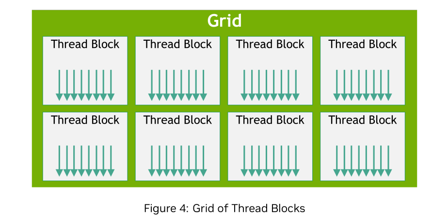

# Thread_Hierarchy
CUDA에서는 병렬 실행을 위해 threadIdx라는 내장 변수를 사용한다. 
이 변수는 **(x, y, z)** 의 세 가지 좌표를 가지는 **3차원 벡터** 형태 이며,
이를 통해 스레드를 1차원, 2차원, 또는 3차원 형태로 구성할 수 있다.

즉, 스레드들은 하나의 thread block을 이루며, 이 블록은 1D(선형), 2D(행렬), 또는 3D(입체) 구조로 정의될 수 있다. 이러한 구성 방식 덕분에 벡터, 행렬, 볼륨(3차원 데이터) 같은 다양한 데이터 도메인을 자연스럽게 다룰 수 있다.

### 스레드 인덱스와 ID의 관계
스레드의 위치와 실제 고유 ID(번호)는 다음과 같은 규칙으로 계산된다.

 - **1차원 블록(1D block)** : 인덱스와 ID가 동일하다.
 $$
 \text{threadID} = x
 $$

 - **2차원 블록(blockDim = Dx, Dy)** : y가 증가할 때마다 Dx개의 스레드가 선형적으로 쌓인다.
 $$
 \text{threadID} = x + y \times Dx
 $$

 - **3차원 블록(blockDim = Dx, Dy, Dz)** : z축 방향으로 갈수록 한 층(=Dx $\times$ Dy)의 스레드가 더해진다.
 $$
 \text{threadID} = x + y \times Dx + z \times Dx \times Dy
 $$
  
이처럼 모든 스레드는 (x, y, z) 좌표를 통해 자신이 처리해야 할 데이터를 식별할 수 있다.

#### Example: Matrix Addition
다음은 두 행렬 $A$와 $B$를 더해 $C$에 저장하는 CUDA 커널 예제이다.

```cpp
// 커널 정의
__global__ void MatAdd(float A[N][N], float B[N][N], float C[N][N])
{
    int i = threadIdx.x;
    int j = threadIdx.y;
    C[i][j] = A[i][j] + B[i][j];
}
```

이 커널은 하나의 스레드가 행렬의 한 원소를 담당한다.
즉, `(i, j)` 위치의 스레드가 `A[i][j]`와 `B[i][j]`를 더해 `C[i][j]`를 계산한다.

```cpp
int main(void){
    ...
    // Kernel Invocation with one block of N * N * 1 threads
    int numBlocks = 1;
    dim3 threadsPerBlock(N, N);
    MatAdd<<<numBlocks, threadsPerBlock>>>(A, B, C);
    ...
}
```

- `dim3 threadsPerBlock(N, N)` : 블록 안에 $N \times N$ 개의 스레드를 생성한다.(이때, 각 스레드가 행렬의 하나의 원소를 담당한다.)
- `<<<numBlocks, threadsPerBlock>>>` : 커널 실행 구문으로, 첫 번째 인자는 블록의 개수, 두 번째 인자는 블록 당 스레드 구성을 의미한다.

즉, 위 코드에서는 하나의 블록 안에 $N \times N$ 개의 스레드를 생성하고, 각 스레드가 행렬의 한 원소를 더하는 연산을 수행한다. 

결국, CUDA의 핵심 아이디어는 "데이터의 구조와 동일한 형태로 스레드를 배치해 각 스레드가 데이터의 한 부분을 독립적으로 처리하도록 하는 것"이다.

앞서 살펴본 예제에서는 하나의 블록에 모든 스레드를 포함시켜 행렬 덧셈을 수행했다. 하지만 GPU의 하드웨어 구조상 한 블록에 포함될 수 있는 스레드의 수에는 한계가 있다. 이는 하나의 블록에 속한 모든 스레드가 동일한 **Streaming Multiprocessor(SM)** 안에서 동시에 실행되어야 하며, 그 SM의 **공유 메모리(shared memory)** 와 **레지스터(Register)** 같은 제한된 자원을 함께 사용하기 때문이다.

현재 대부분의 GPU에서는 **하나의 블록당 최대 1024개의 스레드**만 생성할 수 있다.
즉, 스레드가 너무 많아지면 한 SM에 모두 배치할 수 없기 때문에, 여러 개의 블록을 만들어 나누어 처리해야 한다.

### 블록과 그리드(Grid of Thread Blocks)
CUDA는 이러한 제약을 극복하기 위해 **여러 개의 스레드 블록(thread Block)** 을 동시에 실행할 수 있도록 한다.

커널 함수는 동일한 형태의 블록들을 여러 개 생성해 실행할 수 있으며, 전체 스레드 수는 **(블록당 스레드 수 x 블록의 개수)** 로 계산된다.

블록들은 다시 **그리드(grid)** 라는 상위 구조 안에 배치된다.
즉, 스레드들이 블록으로 묶이고, 블록들이 다시 그리드 형태로 구성되는 계층 구조이다.

그리드는 1차원(1D), 2차원(2D), 3차원(3D) 형태로 정의될 수 있으며, 이는 데이터의 구조에 따라 자연스럽게 대응된다.
예를 들어, 행렬이나 이미지 같은 2차원 데이터를 처리할 때는 2D 그리드를 사용하는 것이 일반적이다.

그리드의 크기(즉, 블록의 개수)는 보통 처리해야할 데이터의 크기에 의해 결정된다. 대부분의 경우 데이터의 전체 크기는 GPU의 코어 수보다 훨씬 크기 때문에, 여러 개의 블록을 만들어서 병렬로 나누어 처리하게 된다.

#### 그리드와 블록의 정의 방식
커널 실행 시 사용하는 `<<<...>>>` 구문에는 두 가지 인자가 들어간다.
첫 번째는 **블록의 개수** , 두 번째는 **각 블록 내의 스레드 구성** 이다. 이 값들은 정수형(int)뿐 아니라 3차원 구조체인 `dim3` 타입으로도 지정할 수 이싿.

예를 들어, 다음 코드는 앞서의 행렬 덧셈(MatAdd) 예제를 다중 블록 구조로 확장한 것이다.
```cpp
// 커널 정의
__global__ void MatAdd(float A[N][N], float B[N][N], float C[N][N])
{
    int i = blockIdx.x * blockDim.x + threadIdx.x;
    int j = blockIdx.y * blockDim.y + threadIdx.y;
    if(i < N && j< N)
        C[i][j] = A[i][j] + B[i][j];
}

int main(void)
{
    dim3 threadsPerBlock(16, 16);
    dim3 numBlocks(N / threadsPerBlock.x, N / threadsPerBlock.y);
    MatAdd<<<numBlocks, threadsPerBlock>>>(A, B, C);
}
```
이 코드에서
 - `threadsPerBlock(16, 16)`은 한 블록 안에 16x16 = 256 개의 스레드를 생성하고,
 - `numBlocks` 는 전체 행렬 크기에 맞게 블록을 몇 개 만들지를 계산한다.

이 예제에서는 N이 16의 배수라고 가정했지만, 실제로는 나누어떨어지지 않아도 된다. 남는 데이터는 마지막 블록의 일부 스레드가 처리하도록 조건문 `if (i < N && j < N)` 으로 제어할 수 있다.

#### 블록 인덱스와 스레드 인덱스
각 블록은 그리드 내에서 **고유한 인덱스(blockIdx)** 를 갖는다.
마찬가지로, 각 스레드는 블록 내에서 **threadIdx** 로 자신의 위치를 알 수 있다. 또한, blockDim은 한 블록이 가진 스레드의 차원 정보를 알려준다. 따라서 전역 좌표계에서 스레드가 처리해야 할 데이터를 계산하려면, 다음과 같은 식을 사용한다.
$$
i = blockIdx.x \times blockDim.x + threadIdx.x \\
j = blockIdx.y \times blockDim.y + threadIdx.y
$$
이 계산을 통해 각 스레드는 자신이 처리할 행렬의 (i, j) 위치를 정확히 알 수 있다.

#### 블록 간 독립성과 확장성
CUDA의 중요한 설계 원칙 중 하나는 **"블록 간의 독립성"** 이다.
각 블록은 서로 간섭하지 않고 독립적으로 실행될 수 있어야 하며, GPU는 이러한 블록들을 **어떤 순서로든, 병렬 또는 순차적으로** 실행할 수 있다.

이 덕분에 동일한 CUDA 코드는 GPU의 성능이나 SM 개수와 관계없이 그대로 실행된다. 
즉, 하드웨어가 더 많은 SM을 가지고 있다면 자동으로 더 많은 블록이 병렬로 처리되어 코드 수정 없이도 성능이 향상된다.
이것이 **CUDA의 확장성(Scalability)** 을 가능하게 하는 핵심이다.


#### 스레드 간 협업과 동기화
하나의 블록 내에서 스레드들은 **공유 메모리(Shared Memory)** 를 통해 데이터를 주고받을 수 있으며,
`__syncthreads()` 함수를 이용해 동기화할 수 있다.

이 함수는 **블록 내 모든 스레드가 특정 지점에 도달할 때까지 대기하는 "장벽(barrier)" 역할** 을 한다.
즉, 모든 스레드가 해당 위치에 도착하기 전까지 다음 단계로 넘어가지 않는다.

공유 메모리는 각 SM 내부에 존재하는 **저지연(on-chip) 메모리** 로, CPU의 L1 캐시처럼 빠르지만 용량이 제한되어 있다.
따라서 이를 적절히 활용하면 전역 메모리(Global Memory)에 비해 훨씬 빠른 데이터 접근과 협업이 가능하다.

또한, CUDA 9 이후에는  **Cooperative Groups API**를 통해 더 세밀한 수준의 스레드 동기화도 지원된다.

결국, CUDA의 스레드-블록-그리드 구조는 **병렬 연산의 단위(스레드)** 와 **확장성 있는 실행 단위(블록)** 를 결합해, 
작은 코어 수에서 대규모 GPU까지 동일한 코드를 효율적으로 실행할 수 있게 하는 핵심적인 프로그래밍 모델이다.

## Thread Block Clusters
앞서 살펴본 그리드(grid)와 블록(block) 구조는 CUDA 프로그래밍 모델의 기본 계층이었다. 
하지만 NVIDIA Compute Capability 9.0(즉, Hopper 아키텍처 세대)부터는 이보다 한 단계 더 높은 계층 구조가 도입되었다.
바로 Thread Block Cluster(스레드 블록 클러스터)라는 개념이다.

Thread Block Cluster는 여러 개의 **스레드 블록(thread block)** 을 하나의 그룹으로 묶은 계층이다.
기존에는 하나의 블록이 하나의 **Streaming Multiprocessor(SM)** 위에서만 실행되었지만, 클러스터 단위에서는 여러 블록이 함께 묶여서 **GPU Processing Cluster(GPC)** 라는 더 큰 하드웨어 단위 위에서 **동시에(co-scheduled)** 실행된다.

즉, **스레드(thread)** 들은 블록 내부에서 협업하며, **블록(block)** 들은 클러스터 내부에서 협업할 수 있게 된 것이다.

이 새로운 계층은 여러 블록이 **서로 협력하거나 데이터를 공유해야 하는 고성능 병렬 연산** 을 보다 효율적으로 수행할 수 있게 된다.

### 클러스터의 구성과 크기
Thread Block Cluster는 블록과 마찬가지로, 1차원(1D), 2차원(2D), 또는 3차원(3D) 형태로 구성할 수 있다.
즉, 하나의 클러스터는 여러 블록으로 이루어지고, 이 클러스터들이 다시 그리드 형태로 배열된다.


CUDA에서는 프로그래머가 **클러스터 내 블록의 개수**를 직접 정의할 수 있다.
표준적인 **이식 가능한 최대 클러스터 크기(portable cluster size)** 는 **8개의 블록** 이다.
즉, 하나의 클러스터 안에 최대 8개의 블록을 넣을 수 있다는 뜻이다.

단, GPU의 하드웨어 구성이나 **MIG(Multi-Instance GPU)** 설정이 8개의 멀티프로세서를 모두 지원하지 못하는 경우에는 자동으로 더 작은 클러스터 크기로 제한된다.
반대로, 더 큰 GPU에서는 8개보다 많은 블록을 포함하는 대형 클러스터를 지원할 수도 있다.

이러한 하드웨어별 세부 지원 정보를 확인하려면, `cudaOccupancyMaxPotentialClusterSize()` API를 이용하면 된다.
이 함수는 현재 GPU 아키텍쳐에서 지원 가능한 최대 클러스터 크기를 질의할 수 있도록 해준다.

### 클러스터 기반 커널 실행과 변수 정의
클러스터를 사용하는 커널이 실행될 때도, 프로그래머는 여전히 익숙한 `<<<gridDim, blockDim>>>` 구문을 그대로 사용할 수 있다.
즉, `gridDim` 은 여전히 전체 블록의 개수를 의미한다. 

다만, 이제는 이 블록들이 클러스터 단위로 묶여 실행되므로, 각 블록이 클러스터 내에서 어떤 위치(순서, rank)에 속하는지를 Cluster Group API를 통해 확인할 수 있다.

이를 이용하면 같은 클러스터 내의 블록들끼리 데이터를 공유하거나 동기화하는 등의 고급 협업 기능을 구현할 수 있다.

| 계층                   | 구성 단위       | 실행 위치    | 협업 방식                                     |
| -------------------- | ----------- | -------- | ----------------------------------------- |
| Thread               | 가장 작은 실행 단위 | SM 내부    | 공유 메모리(shared memory) 및 `__syncthreads()` |
| Thread Block         | 여러 스레드의 집합  | 한 개의 SM  | 블록 내 동기화 및 데이터 공유                         |
| Thread Block Cluster | 여러 블록의 집합   | 한 개의 GPC | Cluster Group API로 블록 간 협업                |
| Grid                 | 여러 클러스터의 집합 | 전체 GPU   | 전역 실행 단위                                  |


앞서 살펴본 Thread Block Cluster 개념은 CUDA의 병렬 구조를 한 단계 확장시켜, 여러 블록이 하나의 클러스터로 묶여 협업할 수 있게 만든 것이다.
이제 이러한 클러스터를 실제로 커널 코드에서 활성화하고 실행하는 방법을 살펴보자.

### 클러스터 활성화 방법
Thread Block Cluster는 커널에서 **컴파일 시(compile-time)** 혹은 **런타임(runtime)** 에 설정할 수 있다.
즉, 클러스터의 크기를 코드 작성 시점에 고정시킬 수도 있고, 프로그램 실행 도중에 동적으로 지정할 수도 있다.

#### 컴파일 시 클러스터 설정 (Compile-time Cluster Attribute)
컴파일 시점에 클러스터 크기를 지정하려면,
커널 정의 부분에 `__cluster_dims_(X, Y, Z)` 속성을 붙인다.

예를 들어, 다음 코드는 **X 방향으로 2개의 블록**, Y와 Z 방향으로 각각 1개의 블록을 가지는 클러스터를 정의한 예시이다.
```cpp
// 커널 정의
// X 방향으로 2개의 블록, Y/Z 방향으로 1개씩
__global__ void __cluster_dims__(2, 1, 1) cluster_kernel(float *input, float *output)
{
    // 클러스터 내의 블록들이 협업할 수 있는 코드 작성 가능
}

int main(void){
    float *input, *output;
    dim3 threadsPerBlock(16, 16);
    dim3 numBlocks(N / threadsPerBlock.x, N/ threadsPerBlock.y);

    // 커널 실행(클러스터 크기는 이미 컴파일 시 고정됨)
    cluster_kernel<<<numBlocks, threadsPerBlock>>>(input, output);
}
```

이 방식에서 주의할 점은 다음과 같다.
 - 클러스터 크기(`__cluster_dims__`)는 컴파일 시 고정되므로 실행 중에 변경할 수 없다.
 - `gridDim`(그리드의 크기)은 여전히 **블록의 개수** 기준으로 계산된다.
 - 단, **그리드 차원은 클러스터 크기의 배수**여야 한다.(예: X방향으로 2개 블록이 모여 하나의 클러스터를 이루므로, 전체 블록 수도 2의 배수여야 한다.)

즉, `gridDim`은 변하지 않지만 내부적으로 블록들이 클러스터 단위로 묶여 실행되는 것이다.

#### 런타임 클러스터 설정 (Runtime Cluster Launch)
컴파일 시점이 아닌 **런타임에서 클러스터 크기를 동적으로 지정**할 수도 있다.
이때는 기존 `<<<>>>` 실행 방식 대신, `cudaLaunchKernelEx()` API를 사용한다.
```cpp
// 커널 정의
// 클러스터 크기를 명시하지 않음 (런타임에 지정)
__global__ void cluster_kernel(float *input, float *output)
{
    // 클러스터 내부 동작 정의
}

int main(void)
{
    float *input, *output;
    dim3 threadsPerBlock(16,16);
    dim3 numBlocks(N / threadsPerBlock.x, N / threadsdPerBlock.y);

    // 런타임 클러스터 설정
    cudaLaunchConfig_t config = {0};
    config.gridDim = numBlocks;
    config.blockDim = threadsPerBlock;

    // 런타임 클러스터 속성 설정
    cudaLaunchAttribute attribute[1];
    attribute[0].id = cudaLaunchAttributeClusterDimension;
    attribute[0].val.clusterDim.x = 2; // x방향 2개 블록
    attribute[0].val.clusterDim.y = 1; 
    attribute[0].val.clusterDim.z = 1;

    config.attrs = attribute;
    config.numAttrs = 1;

    // 커널 실행
    cudaLaunchKernelEx(&config, cluster_kernel, input, output);
}
```

이 방식의 장점은 유연성이다.
같은 커널이라도 **실행 시점에 클러스터 크기를 자유롭게 변경**할 수 있으므로, 다양한 GPU 아키텍처나 데이터 크기에 맞게 최적화할 수 있다.

다만, 이 경우에도 `gridDim`은 여전히 블록 단위로 계산되며, 클러스터 크기의 배수여야 한다는 제약은 동일하다.

Compute Capability 9.0 이상(GPU Hopper 세대)에서는, 
**클러스터 내의 모든 불록이 반드시 동일한 GPU Processing Cluster(GPC)** 위에서 실행된다.
즉, 하드웨어 수준에서 **클러스터 단위의 동기화와 통신이 보장** 된다.

이러한 동작은 새로운 Cluster Group API를 통해 제어할 수 있다.

Cluster Group API는 클러스터 내부 블록 간의 협업을 지원하기 위한 다양한 기능을 제공한다.

| 기능               | 설명                                       |
| ---------------- | ---------------------------------------- |
| `cluster.sync()` | 클러스터 내 모든 블록을 동기화 (블록 간 하드웨어 수준 barrier) |
| `num_threads()`  | 클러스터 전체 스레드 개수 반환                        |
| `num_blocks()`   | 클러스터 전체 블록 개수 반환                         |
| `dim_threads()`  | 클러스터 내 스레드의 차원 정보 반환                     |
| `dim_blocks()`   | 클러스터 내 블록의 차원 정보 반환                      |

즉, 하나의 클러스터 안에 여러 블록이 존재하더라도, `cluster.sync()`를 이용하면 **마치 하나의 거대한 블록처럼** 모든 블록이 동일한 시점에서 실행을 맞출 수 있다.

### 분산 공유 메모리 (Distributed Shared Memory)
클러스터에 속한 블록들은 기존의 각 블록 내부 공유 메모리뿐만 아니라, **Distributed Shared Memory(DSM)** 라고 불리는 확장된 메모리 공간을 함께 사용할 수 있다.

이 DSM은 클러스터에 속한 모든 블록이 **읽기(read), 쓰기(write)** , 그리고 **원자적 연산(atomic operation)** 을 수행할 수 있는 **공유 자원** 이다.

즉, 블록 간에도 데이터를 직접 공유할 수 있어, 예를 들어 **히스토그램(histogram)** 연산과 같이 여러 블록이 하나의 공통 메모리 공간에 결과를 누적해야 하는 경우 매우 효율적이다. 

기존에는 전역 메모리(global memory) 접근을 통해야만 가능했던 연산을 DSM을 통해 더 빠르고 효율적으로 수행할 수 있게 된 것이다.

| 항목             | 설명                                                     |
| -------------- | ------------------------------------------------------ |
| **클러스터 설정 방식** | 컴파일 시(`__cluster_dims__`) 또는 런타임(`cudaLaunchKernelEx`) |
| **최대 클러스터 크기** | 보통 8개의 블록 (하드웨어/구성에 따라 달라짐)                            |
| **클러스터 내 동기화** | `cluster.sync()` 사용 (하드웨어 레벨에서 보장)                     |
| **데이터 공유**     | Distributed Shared Memory를 통해 블록 간 접근 가능               |
| **장점**         | 블록 간 협업, 데이터 공유, 확장성 향상, 고성능 병렬 처리                     |


## Blocks as Clusters
기존에는 `__cluster_dims__` 속성을 통해 **클러스터의 형태(크기)** 를 지정했다.
그러나 이 방식에서는 **클러스터의 개수(number of clusters)** 가 암묵적으로 결정되어, 사용자가 명시적으로 제어할 수 없었다.

즉, 커널이 실행될 때 몇 개의 클러스터가 만들어지는지는 
전체 그리드 크기와 클러스터 구성(block 수)에 따라 **자동 계산**되어야 했다.

다음 예제를 살펴보자.
```cpp
__cluster_dims__(2, 2, 2) __global void foo();

foo<<<dim3(16, 16, 16), dim3(1024, 1, 1)>>>();
```
이 코드는 16x16x16 개의 스레드 블록으로 구성된 커널을 실행한다.
하지만 `__cluster_dims__(2, 2, 2)` 속성이 지정되어 있으므로, 실제로는 이를 **8x8x8 개의 클러스터** 로 묶어 실행하게 된다.
 - 각 클러스터는 2x2x2 = 8개의 블록으로 구성되고, 
 - 전체 그리드(grid)는 8x8x8 개의 클러스터로 이루어진다.

즉, 이 커널은 표면적으로는 4096개의 블록이지만,
내부적으로는 클러스터 단위로 묶인 4096 $\div$ 8 = 512 개의 클러스터가 실행되는 셈이다.

### block_size 속성을 이용한 명시적 클러스터 구성
Compute Capability 9.0 부터는 `__block_size__` 속성을 사용하여 **클러스터 단위로 명시적인 실행 제어** 를 할 수 있게 되었다.

즉, `__block_size__` 를 사용하면 
"블록 크기" 와 "클러스터 크기"를 **동시에 정의** 할 수 있으며, 이를 통해 그리드를 **클러스터 기준으로 직접 지정** 할 수 있다.

예를 들어 다음 코드를 보면,
```cpp
// 각 블록당 1024 스레드, 각 클러스터당 2x2x2 블록
__block_size__((1024, 1, 1), (2, 2, 2)) __global__ void foo();

// 8x8x8 개의 클러스터로 구성된 그리드 실행
foo<<<dim3(8, 8, 8)>>>();
```

이 코드의 의미는 다음과 같다.

| 속성                         | 의미                              |
| -------------------------- | ------------------------------- |
| `(1024, 1, 1)`             | 각 블록의 스레드 구성(한 블록에 1024개의 스레드)  |
| `(2, 2, 2)`                | 하나의 클러스터 안에 2×2×2 = 8개의 블록이 포함됨 |
| `foo<<<dim3(8, 8, 8)>>>()` | 전체 8×8×8개의 **클러스터 단위**로 실행      |

즉, 여기서 **그리드 차원** 은 블록의 개수가 아니라 **클러스터의 개수** 로 해석된다. 
이것이 바로 "*Blocks as Clusters*" 모드의 핵심이다.

### __block_size__의 구조
`__block_size__` 속성은 두 개의 튜플(tuple)을 인자로 받는다.

```cpp
__block_size__((blockDim.x, blockDim.y, blockDim.z), (clusterDim.x, clusterDim.y, clusterDim.z))
```

- 첫 번째 튜플 : 스레드 블록의 크기(각 블록 내에서의 스레드 배치)
- 두 번째 튜플 : 클러스터의 크기(블록수, 한 클러스터에 몇 개의 블록이 포함되는지)

만약 두 번째 튜플(클러스터 크기)을 지정하지 않으면, 기본값은 (1, 1, 1) 로 간주되어, 기존과 동일한 단일 블록 모드로 실행된다.

### 실행 구문 및 주의 사항
Blocks as Clusters 모드에서는 실행 구문 (`<<<>>>`)의 해석이 약간 달라진다.

 - `foo<<<dim3(8,8,8)>>>()` 에서 첫 번째 인자(`8x8x8`)는 이제 **블록 수(blocks)** 가 아닌 **클러스터 수(Clusters)** 로 해석된다.
 - 두 번째와 세 번째 인자로는 반드시 `1`과 `0`을 지정해야 하며, 마지막 인자에 **스트림(stream)** 을 명시한다.
   ```cpp
   foo<<<dim3(8,8,8), 1, 9=0, stream>>>();
   ```
   이는 CUDA 런타임 규칙에 따라 정의된 실행 형식으로, 다른 값을 전달하면 **정의되지 않은 동작(undefined behavior)** 이 발생할 수 있다.
 - `__cluster_dims__` 와 `__block_size__` 의 두 번째 튜플(클러스터 크기)을 **동시에 사용하는 것은 금지** 되어 있다.
   두 속성 모두 클러스터 크기를 지정하기 때문에,  둘 다 지정하면 컴파일러가 혼동을 일으킨다.
   다시 말해,
    - `__cluster_dims__` : 클러스터 크기만 지정
    - `__block_size__` : 블록 크기 + 클러스터 크기 모두 지정
   따라서 `__block_size__`를 사용하면 자동으로 "Blocks as Clusters" 모드가 활성화되고, 컴파일러는 `<<<>>>` 안의 첫 번째 인자를 **클러스터 개수** 로 인식한다.

| 구분                     | 속성                 | 실행 단위           | 지정 방식                              | 예시                       |
| ---------------------- | ------------------ | --------------- | ---------------------------------- | ------------------------ |
| **기본 블록 구조**           | 없음                 | 블록 단위           | `<<<numBlocks, threadsPerBlock>>>` | 일반 CUDA 커널               |
| **클러스터 기반 실행**         | `__cluster_dims__` | 블록 묶음(암묵적 클러스터) | 클러스터 크기만 지정                        | `foo<<<grid, block>>>`   |
| **Blocks as Clusters** | `__block_size__`   | 클러스터 단위 (명시적)   | 블록 크기 + 클러스터 크기 지정                 | `foo<<<numClusters>>>()` |

"Block as Clusters" 개념은 CUDA 프로그래밍 모델을 더 명시적이고, 더 세밀하게 제어할 수 있게 만든 발전된 구조이다. 기존에는 커널이 자동으로 블록을 묶어 클러스터로 구성했지만, 이제는 프로그래머가 직접 **클러스터 개수, 블록 수, 스레드 수** 를 명확히 정의할 수 있게 되었다.

이로써 다음과 같은 장점이 생긴다.
 - 대규모 데이터 구조나 3D 격자(grid) 계산에서 **클러스터 단위 병렬화** 를 더 직관적으로 구현이 가능하다.
 - 하드웨어 리소스(SM, GPC)를 **명확히 제어** 하여 성능 튜닝에 용이하다.
 - 클러스터 기반의 **공유 메모리 협업 및 동기화** 를 보다 체계적으로 설계할 수 있다.

| 핵심 개념              | 설명                                                       |
| ------------------ | -------------------------------------------------------- |
| `__cluster_dims__` | 암묵적으로 클러스터 크기만 지정 (클러스터 수는 자동 계산)                        |
| `__block_size__`   | 명시적으로 블록 크기와 클러스터 크기 모두 지정                               |
| Blocks as Clusters | 커널을 클러스터 단위로 직접 실행하도록 설정하는 기능                            |
| 제약사항               | `__cluster_dims__`와 `__block_size__`의 클러스터 크기는 동시에 지정 불가 |
| 장점                 | 클러스터 단위의 명시적 제어, 확장된 병렬 협업, 최적화 용이                       |
