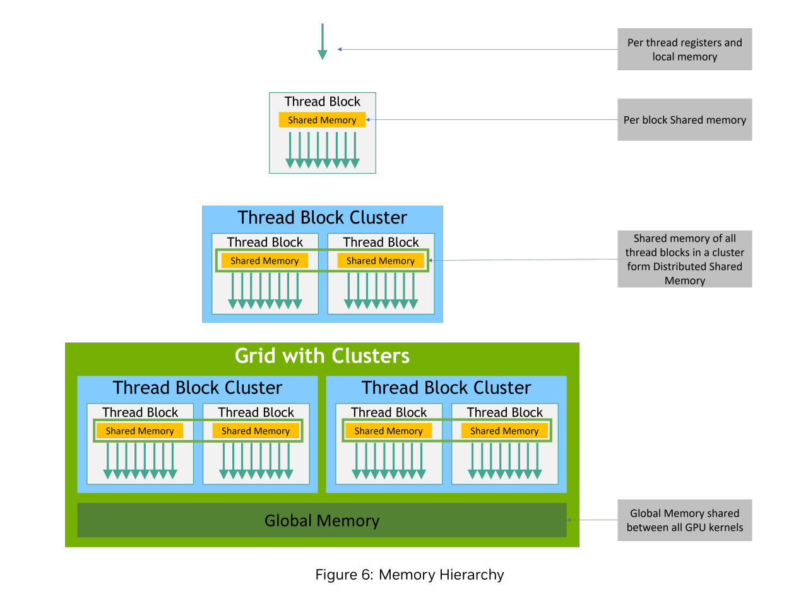

# Memory Hierarchy
GPU의 메모리 계층은 "얼마나 가까운가(지연)"와 "얼마나 넓은가(대역폭-용량)" 사이의 절충으로 설계된다. 가까울수록 빠르지만(=작고 비싸고, 스레드/블록에 더 국소적), 멀수록 느리지만(=크고 저렴하고, 그리드 전체가 공유) 범용성이 높다. 이 축 위에 각 레벨이 배치되고, 스케줄러는 **아주 많은 스레드/워프를 번갈아 실행** 하며 느린 메모리 대기 시간을 숨긴다. 이 기본 철학을 잡아두고 각 레벨을 내려가 봅니다.

## 스레드 전용 레벨: 레지스터와 로컬 메모리
**레지스터** 는 SM 칩 내부에 있는 가장 빠른 저장소로, 산술 명령이 곧바로 레지스터를 피연산자로 사용한다. 접근 지연과 에너지 소모가 극히 낮고, 스레드마다 사적으로 소유한다. 다만 개수가 제한되어 과사용하면 점유율(occupancy)이 떨어진다.

**로컬 메모리** 는 "로컬"이라는 이름과 달리 장치 글로벌 메모리(오프칩 DRAM)에 할당되는 스레드 전용 공간이다. 레지스터를 초과하는 배열/스필(Spill)이 여기에 놓이며 지연이 크다.

## 블록수준: 공유 메모리(Shared Memory)
**공유 메모리** 는 SM 온칩 스크래치패드로, **같은 블록의 스레드들이 협업**할 때 데이터 재사용과 동기화를 가능하게 한다. 레지스터보단 느리지만 글로벌 메모리보다 수십~수백 배 빠른 접근이 가능하다.

공유 메모리 타일링은 메모리 집약적 커널의 구조를 바꾼다. 예를 들어 **스텐실/컨볼루션** 에서 입력 타일을 공유 메모리에 한 번 올려 블록 내부 스레드가 재사용하면, **글로벌 접근 횟수** 가 줄어 산술집약도가 크게 올라간다.(컨볼루션 필터는 상수 메모리에 두고, 입력은 공유 메모리 타일에 적재)

블록 내부 동기화는 `__syncthreads()` 로 수행하며, **모든 스레드가 동일한 지점** 을 만나도록 분기 구조를 주의해야 한다.

최근 아키텍처 Thread Block Cluster가 지원되는 경우, 클러스터를 이룬 블록들이 서로의 공유 메모리에 접근하는 **분산 공유 메모리(DSMEM)** 를 제공하여 블록 각 협업 범위를 확장한다. 전통적 CUDA 모델에서는 블록 간 직접 동기화가 불가능했지만(투명 확장성의 전제), 클러스터는 제한된 범위에서 이를 완화한다.

## 그리드 전체: 글로벌/상수/텍스처 메모리
**글로벌 메모리** 는 장치의 대용량 오프칩 DRAM이다. 지연이 크고 대역폭이 병목이 되기 쉬워, **메모리 코얼레싱** 과 **데이터 재사용** 이 성능의 생명줄이다. 같은 워프의 스레드가 **연속 주소** 를 한 번의 버스트로 읽도록 배열/인덱싱을 설계해야 한다.

**상수 메모리(64KB)** 는 읽기 전용 전 그리드 공유이며, 작은 상수(예: 컨볼루션 필터)를 두면 전용 캐시가 높은 히트율로 대역폭을 사실상 0에 가깝게 만든다. 컨볼루션의 산술집약도가 0.25 OP/B -> 0.5 OP/B로 즉시 상승하는 전형 사례이다.

**텍스처 메모리** 는 읽기 전용 캐시와 주소 변환/필터링에 최적화되어, 2D 지역성이나 보간이 중요한 워크로드에서 유리하다.

## L1/L2 및 DRAM -- "대역폭의 벽"과 코얼레싱
GPU는 온칩 L1/SM 캐시와 칩 전체 L2 캐시를 통해 오프칩 접근을 줄인다. 그럼에도 DRAM은 근본적으로 느리다. 예컨대 A100(1555GB/s)에서 산술 집약ㄷ 0.25 FLOP/B 커널은 이론상 389GFLOPS에 갇혀, FP32 피크의 수 %만 사용한다. 그래서 타일링, 재사용, 코얼레싱이 필수이다. 목표는 가능한 한 "같은 DRAM 행/버스트"에서 데이터를 많이 뽑아오는 것이다.

## 스케줄링과 지연 숨기기: 워프 교대
SM은 워프 단위로 스케줄한다.(32 스레드) 어떤 워프가 메모리를 기다리는 동안 **다른 워프를 곧바로 실행(제로-사이클 컨텍스트 스위칭)** 하여 지연을  숨긴다. 이 기법이 효과를 내려면 **충분한 활성 워프(점유율)** 가 필요하다.
